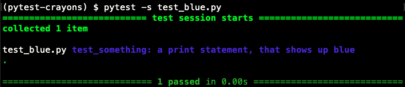
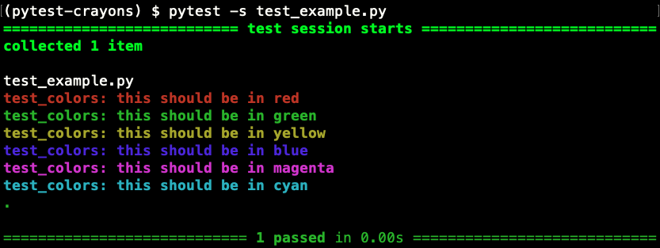

# pytest-crayons

A pytest plugin for colorful print statements.

## Installation

```
pip install pytest-crayons
```

## Usage

Include a color fixture in the param list of a test. 
Then use it instead of `print`.

```python
def test_something(blue):
    ... # some code
    blue("a print statement, that shows up blue")
    ... # more test code
```

Just like normal print statements, you only see the output if:

* There's an failure in the test.
* or you pass in `-s` or `--capture=no`
* or you wrap the statement in a `with capsys.disabled():` block.

For our examples, we'll use `-s`:



## Available colors

* red, 
* green
* yellow
* blue
* magenta
* cyan

Example with all colors: 

```python
def test_colors(red, green, yellow, blue, magenta, cyan):
    print("") # for the newline
    red("this should be in red")
    green("this should be in green")
    yellow("this should be in yellow")
    blue("this should be in blue")
    magenta("this should be in magenta")
    cyan("this should be in cyan")
```

